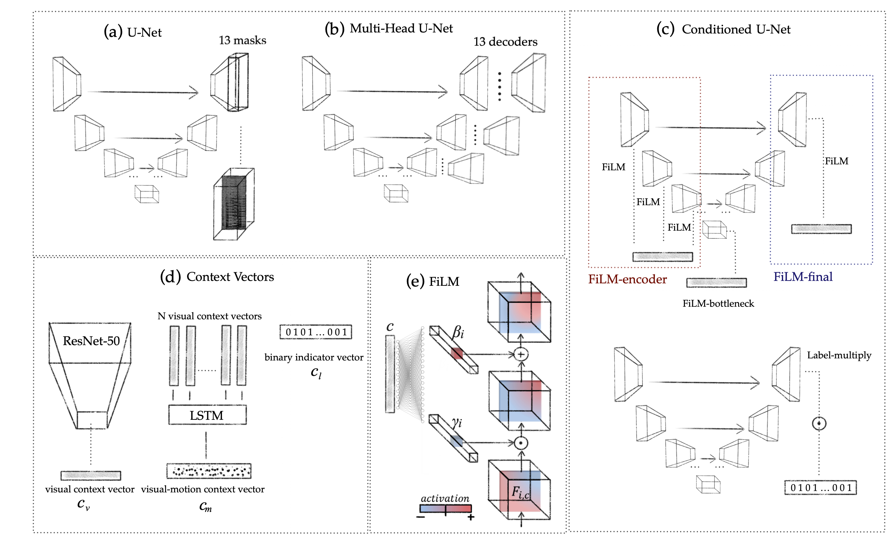

## Conditioned Source Separation for Music Instrument Performances
#### Olga Slizovskaia, Gloria Haro, Emilia Gómez
#### Department of Information and Communication Technologies, Pompeu Fabra University, Barcelona, Spain

Separating different music instruments playing the same piece is a challenging task since the different audio sources are synchronized and playing in harmony. Moreover, the number of sources may vary for each piece and some of the sources may belong to the same family of instruments, thus sharing timbral characteristics and making the sources more correlated.
This paper proposes a source separation method for multiple musical instruments sounding simultaneously and explores how much additional information apart from the audio stream can lift the quality of source separation. We explore conditioning techniques at different levels of a primary source separation network and utilize two extra modalities of data, namely presence or absence of instruments in the mixture, and the corresponding video stream data.

#### Code is released and can be found in the [code](code) folder

[Project Page](https://veleslavia.github.io/conditioned-u-net/)

If you find our code or project useful in your research, please cite:

     @inproceedings{slizovskaia2020conditioned,
       title = {Conditioned Source Separation for Music Instrument Performances},
       author = {Slizovskaia, Olga and Haro, Gloria and G{\'o}mez Emilia},
       booktitle = {tba},
       year = {2020}
     }
